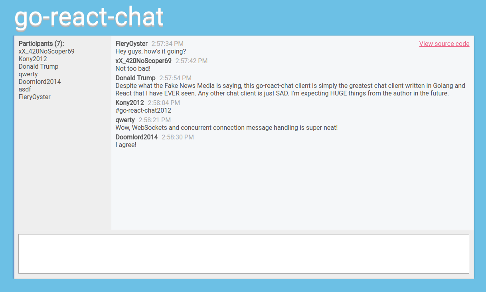

# go-react-chat
go-react-chat was created with a desire to better understand programming in Golang and it's concurrency tools via goroutines and channels. The Golang server serves a React.js front-end application bundled and bootstrapped together with `create-react-app`. When the user connects to the chat client via the React UI, a WebSocket connection is initiated with the Golang server, and the chat interface is then maintained by the server and socket communication.

This application is slightly buggy, and errors are not handled gracefully. This is because, well, I'm lazy, and making a 100% refined chat client wasn't the point of this project. However, with a faster hosting platform (hooray for free Heroku instances!), and a little more polished code, this application could theoretically handle many (thousands?) of concurrent user connections and messages due to the implemented goroutines and channels.

### [Check it out!](https://go-react-chat.herokuapp.com)

